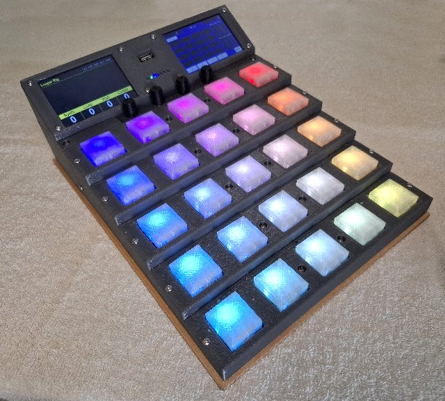

## TE3 - teensyExpression3

### Please see the [teensyExpression3 documentation](https://phorton1.github.io/Arduino-TE3/)

### License

This program is free software: you can redistribute it and/or modify
it under the terms of the GNU General Public License Version 3 as published by
the Free Software Foundation.

This program is distributed in the hope that it will be useful,
but WITHOUT ANY WARRANTY; without even the implied warranty of
MERCHANTABILITY or FITNESS FOR A PARTICULAR PURPOSE.  See the
GNU General Public License for more details.

Please see **LICENSE.TXT** for more information.

